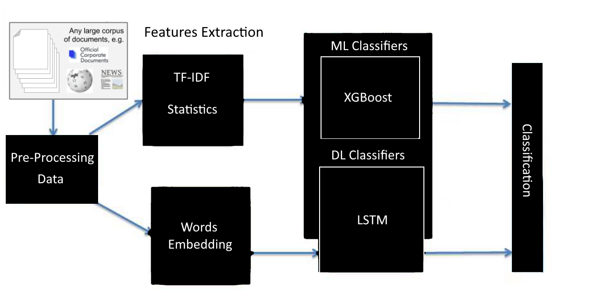

# Truth Guard

<div align="center">

[](https://github.com/PyCQA/pylint)
[](https://github.com/psf/black)
[](http://mypy-lang.org/)


</div>


<div align="center">



</div>

banner.png

A Fully Async-based ML Fake news detection API.

## NoteBook

- Download [GoogleNews-vectors-negative300.bin.gz](https://drive.google.com/u/0/uc?id=0B7XkCwpI5KDYNlNUTTlSS21pQmM) for the **LSTM** model and move it into the `notebook` directory.
- Download [the dataset from kaggle](https://www.kaggle.com/datasets/stevenpeutz/misinformation-fake-news-text-dataset-79k?resource=download) and move it into the `notebook/data-set` directory.
- Train and serialize the model.

## Development Requirements

- Make (GNU command)
- Python (>= 3.9)
- Poetry (1.2)

## Project Structure

<details>
<summary><code>❯ tree app</code></summary>

```sh
.
├── model         # Package contains different config files for the `model` app.
│   ├── crud.py       # Module contains different CRUD operations performed on the database.
│   ├── models.py     # Module contains different data models for ODM to interact with database.
│   ├── router.py     # Module contains different routes for this api.
│   └── schemas.py    # Module contains different schemas for this api for validation purposes.
├── config.py     # Module contains the main configuration settings for project.
├── __init__.py
├── main.py       # Startup script. Starts uvicorn.
└── py.typed      # mypy related file.
```

</details>

## Installation with Make

Having `make` installed and configured on your machine, you can now run `make` under the root directory of this project to explore different available commands to run:

```sh
make

Please use 'make <target>' where <target> is one of:

venv                     Create a virtual environment
install                  Install the package and all required core dependencies
run                      Running the app locally
deploy-deta              Deploy the app on a Deta Micro
clean                    Remove all build, test, coverage and Python artifacts
lint                     Check style with pre-commit
test                     Run tests quickly with pytest
test-all                 Run tests on every Python version with tox
coverage                 Check code coverage quickly with the default Python
build                    Build docker containers services
up                       Spin up the containers
down                     Stop all running containers
```

### 1. Create a virtualenv

```sh
make venv
```

### 2. Activate the virtualenv

```sh
source .venv/bin/activate
```

### 3. Install dependencies

```sh
make install
```

**Note**: _This command will automatically generate a `.env` file from `.env.example`, uninstall the old version of poetry on your machine, then install latest version `1.2.2`, and install the required main dependencies._

### 4. Run The Project Locally

```sh
make run
```

**Note**: _You have to set **DEBUG=info** to access the docs._

## Access Swagger Documentation

> <http://localhost:8000/docs>

## Access Redocs Documentation

> <http://localhost:8000/redocs>

## License

This project and the accompanying materials are made available under the terms and conditions of the [` Apache License Version 2.0`](https://github.com/wiseaidev/truth-guard/blob/main/LICENSE).
